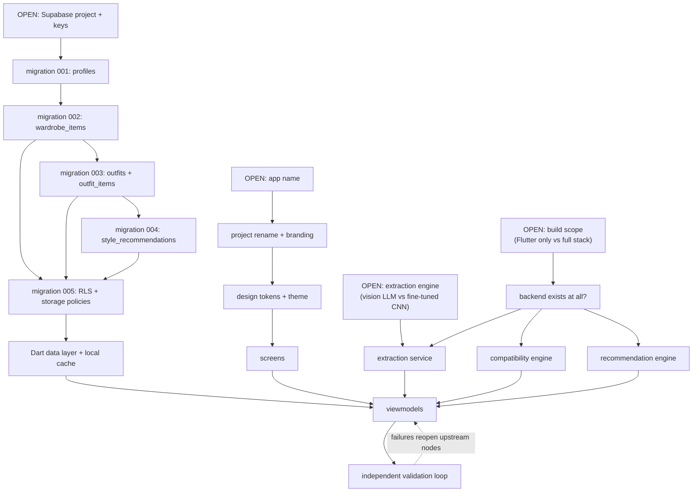

# Skills

Process skills for building the outfit-planner app defined in
[wardrobe_app_PRD.md](../wardrobe_app_PRD.md) and [wardrobe_app_TRD.md](../wardrobe_app_TRD.md).

| Skill | Owns |
|---|---|
| [ui-ux-design](ui-ux-design/SKILL.md) | Screens, design tokens, states, accessibility, Flutter widget conventions |
| [database](database/SKILL.md) | Postgres schema, types, indexes, RLS policies, storage layout |
| [backend](backend/SKILL.md) | Attribute extraction, compatibility engine, recommendation engine, API contracts |
| [migrations](migrations/SKILL.md) | Ordered, reversible, verified schema change process |
| [independent-validation](independent-validation/SKILL.md) | Adversarial verification that the build matches the PRD/TRD |

---

## Two engineering concepts these skills share

Both are referenced by name inside the skills below. They are defined once here.

### Graph engineering

Model work and data as **explicit nodes and edges** rather than as prose or ad-hoc procedure.
Three places this app uses it:

1. **Build dependency graph.** Every deliverable is a node; an edge `A → B` means B cannot be
   correct until A is settled. Work is scheduled by topological order, and any node whose
   upstream changes is marked dirty and re-validated. See `Build DAG` below.
2. **Migration graph.** Each migration is a node with a parent; the schema state is the path from
   the root. Never edit an applied node — append a child. See the migrations skill.
3. **Outfit compatibility graph.** An outfit is a complete graph over garment slots. Nodes are
   items, edges are pairwise compatibility scores. This makes "which item is the weak link" a
   well-defined graph query (lowest incident-edge weight) instead of a heuristic, and makes
   "suggest a swap" a bounded search over candidate replacement nodes. See the backend skill.

### Loop engineering

Never emit a deliverable straight from a generator. Wrap it:

```
propose → validate → (fail) → diagnose → repair → validate → …
                   → (pass) → accept
```

Rules that make a loop safe rather than an infinite spin:

- **Bounded.** Declare max iterations up front (default: 3). On exhaustion, stop and escalate to
  the user with the last failure report. Do not silently accept a failing artifact.
- **Independent validator.** The thing that checks the output must not be the thing that produced
  it, and must not have been given the answer. This is why `independent-validation` is a separate
  skill with its own inputs.
- **Monotonic.** Each iteration must close at least one named failure, and must not reopen a
  previously closed one. Track a failure ledger across iterations; a regression ends the loop.
- **Machine-checkable exit criterion.** "Looks good" is not an exit condition. `flutter analyze`
  clean, all tests green, every PRD acceptance line mapped to a passing check — those are.

---

## Build DAG

Edges point from prerequisite to dependent. `OPEN:` nodes are blocked on a user decision and
must not be guessed at.



The dashed edge is the loop: validation failures mark upstream nodes dirty rather than being
patched at the leaf.

---

## Status of the source documents

These are recorded here so no skill silently resolves them. They are **user decisions**, not
implementation details.

| # | Issue | Where |
|---|---|---|
| 1 | PRD §7 lists "Male-specific styling recommendation module" as **out of scope**, but PRD §4.1/§4.5 and TRD §7/§8 all **specify it**. Direct contradiction. | PRD §7 vs §4.5 |
| 2 | PRD §4.4(b) requires detecting *multiple* garments in one uploaded photo. That is object detection + per-instance classification, materially harder than TRD §4's single-item pipeline. TRD §4 does not describe it. | PRD §4.4 vs TRD §4 |
| 3 | PRD §6 requires offline wardrobe browsing. No local persistence layer appears anywhere in the TRD. | PRD §6 vs TRD §10 |
| 4 | TRD §3 stores one `color_hex` per item. A striped or floral garment has no single dominant colour; averaging produces a colour the garment does not contain, which then feeds the §6 harmony rule. | TRD §3, §6 |
| 5 | TRD §2 specifies a fine-tuned CNN, while TRD §12 concedes no training data exists for the non-Western categories the PRD requires. | TRD §2 vs §12 |
| 6 | PRD §9 asks whether occasion presets must include religious/cultural wear. This determines the `occasion` enum, which the compatibility rules key off. | PRD §9 |
| 7 | Item deletion behaviour is unspecified: what happens to an `outfits` row whose `wardrobe_item` was deleted. | TRD §3 |
